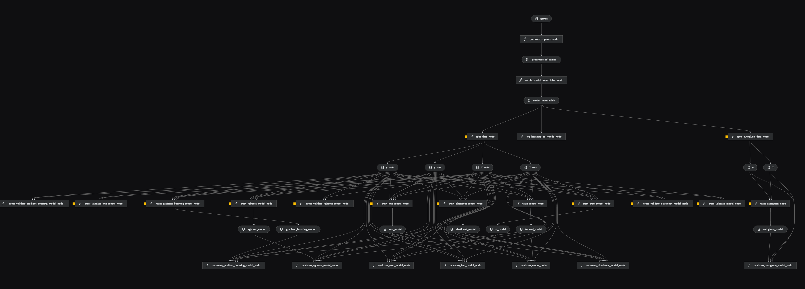
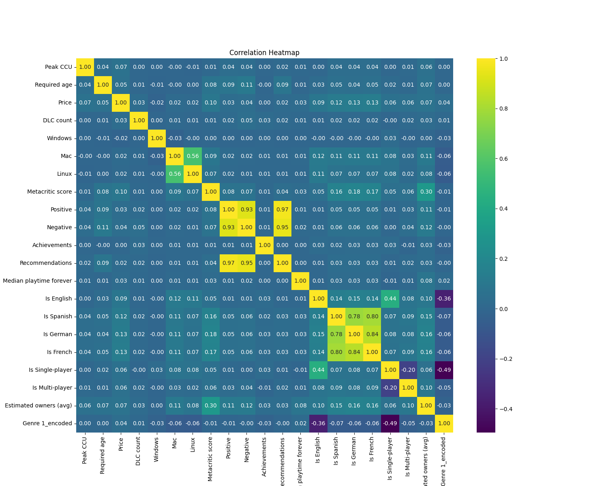

# gamersAI

[](https://kedro.org)

## Description

gamersAI is an MLOps project that is designed to predict the number of potential users of a game based on its parameters. This model can significantly contribute to more effective promotion of video games.

The database was created based on 80,000 game information taken from the publicly available Steam API.

We were able to create a stable predictive model that can predict the average number of potential users with a score of 83% accuracy.

## Frontend and Backend
The main server that handles all queries is the REST API controller `api.py`. It is responsible for communication between the database, the kedro pipeline and the web application. The main module handling web traffic is the `fastapi` library. Depending on the operation being performed, the controller can query the kedro pipeline for prediction or communicate directly with the database. 

Responsible for the user interface is the `streamlit` library, which allows quick and easy development of web applications. It connects to the server executes queries to it.


## Pipeline structure

The pipeline consists of 8 modules. The first to be executed is `data_processing`, where raw data is processed. After that, each model is trained using this data. As the last one, `pipeline_autogluon` is executed, which in its own way is a summary of all the previous models.

```
pipelines
├── data_processing
├── dt_pipeline
├── elasticnet_pipeline
├── gradient_boosting_pipeline
├── knn_pipeline
├── pipeline_autogluon
├── random_forest_pipeline
└── xgboost_pipeline
```



Also implemented is integration with the *[Weights & Biases](https://wandb.ai/site/)* system, which serves to process and visualize data from running pipelines. This system is directly integrated with the pipeline therefore its execution may require logging into the W&B service.



## Database integration

The `db_controller.py` module is responsible for database integration. This controller, using the `sqlite3` library, establishes a direct connection to the database. This connection is mainly used by the `api.py` API controller.

```python
DB_PATH = “data/01_raw/games.db”

def get_db_connection():
    return sqlite3.connect(DB_PATH)
```

It is worth noting that the `games.db` file must be in the described location also because of access through the kedro pipeline.

## First run

> [!IMPORTANT]  
> Make sure you are using **Python 3.10**.

### Create the environment using `venv`.

```
python -m venv venv
```

### Start the virtual environment
> Note: If you are using Windows, run the following command first
> 
> `Set-ExecutionPolicy Unrestricted -Scope Process`.

```
.\venv\Scripts\activate
```

### Declare dependencies `requirements.txt` using `pip` installation.

To install all dependencies, run:

```
pip install -r requirements.txt
```

### Database
Download the database file [here](https://huggingface.co/datasets/Mroxny/gamersAI/resolve/main/games.db) and place it in the folder `/data/01_raw`. 

## Run the pipeline

The entire pipeline can be executed by running:

```
kedro run
```

## Running the system

Starting the whole system is done in two steps. First, start the backend server:

```
fastapi run api.py
```
In the next step, run the web application that connects to the server
```
streamlit run streamlit_app.py
```