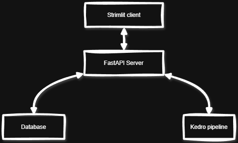
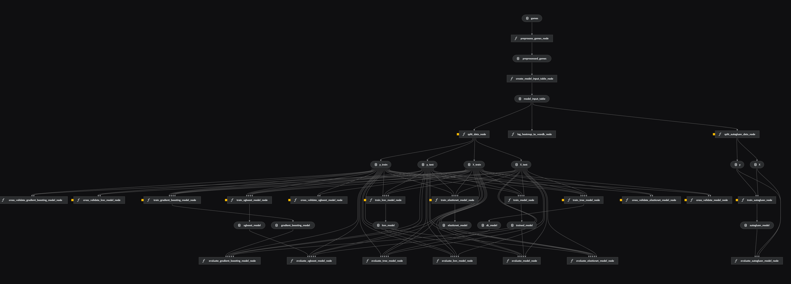
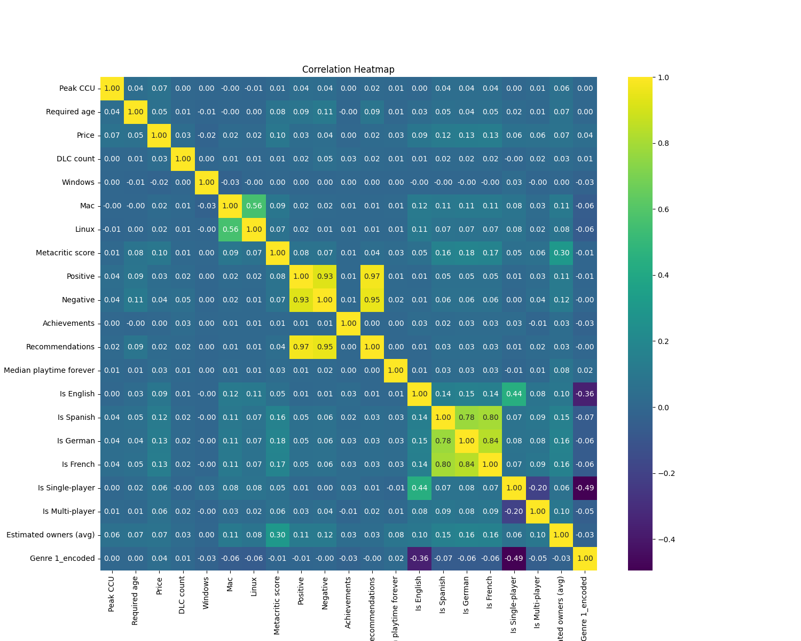

# gamersAI

[](https://kedro.org)

## Opis

gamerAI to projekt MLOps, który ma za zadanie przewidywać liczbę potencjalnych użytkowników danej gry na podstawie jej parametrów. Model ten w znacznym stopniu może przyczynić się do bardziej efektywnego promowania gier wideo.

Baza danych została utworzona na podstawie 80,000 informacji o grach zaczerpniętych z ogólnodostępnego steam API.

Udało nam się stworzyć stabilny model sztucznej inteligencji, który z wynikiem 83% dokładności jest w stanie przewidzieć średnią ilość potencjalnych użytkowników.

## Frontend i Backend
Głównym serwerem obsługujący wszystkie zapytania jest REST API kontroler `api.py`. Odpowiada on za komunikację miedzy bazą danych, potokiem kedro i aplikacją webową. Głównym modułem obsługującym ruch sieciowy jest biblioteka `fastapi`. W zaleznosci od wykonywanej operacji, kontroler może odpytywac potok kedro w celu uzyskania predykcji lub komunikować się bezpośrednio z bazą danych. 

Za interfejs użytkownika odpowiedzialna jest biblioteka `streamlit`, która umożliwia szybkie i łatwe tworzenie aplikacji webowych. Łączy się ona z serwerem wykonuje do niego zapytania.



## Struktura potoku

Potok składa się z 8 modułów. Jako pierwszy wykonywany jest `data_processing`, gdzie przetwarzane są surowe dane. Po tym etapie za pomocą tych danych trenowany jest każdy z modeli. Jako ostatni wykonywany jest `pipeline_autogluon`, który na swój sposób jest podsumowaniem wszystkich poprzednich modeli.

```
pipelines
├── data_processing
├── dt_pipeline
├── elasticnet_pipeline
├── gradient_boosting_pipeline
├── knn_pipeline
├── pipeline_autogluon
├── random_forest_pipeline
└── xgboost_pipeline
```



Zaimplementowana została również integracja z systemem *[Weights & Biases](https://wandb.ai/site/)*, który słuzy za przetwarzanie oraz wizualizację danych z uruchomionych potoków. System ten jest bezpośrednio zintegrowany z potokiem dlatego jego wykonanie może wymagać zalogowanie się do serwisu W&B.



## Integracja z bazą danych

Za integrację z bazą danych jest odpowiedzialny moduł `db_controller.py`. Kontroler ten za pomocą biblioteki `sqlite3` nawiązuje bezpośrednie połączenie z bazą danych. Połączenie to jest głównie wykorzystywane prz kontroler API `api.py`.

```python
DB_PATH = "data/01_raw/games.db"

def get_db_connection():
    return sqlite3.connect(DB_PATH)
```

Warto zauważyć, że plik `games.db` musi znajdować się w opisanym miejscu również ze względu na dostęp przez potok kedro.

## Pierwsze uruchomienie

> [!IMPORTANT]  
> Należy upewnić się że używany jest **Python 3.10**

### Tworzenie środowiska przy użyciu `venv`

```
python -m venv venv
```

### Uruchom wirtualne środowisko
> Note: Jeżeli korzystasz z systemu Windows, najpierw wykonaj poniższą komendę
> 
> `Set-ExecutionPolicy Unrestricted -Scope Process`

```
.\venv\Scripts\activate
```

### Deklaracja zależności `requirements.txt` za pomocą instalacji `pip`

Aby zainstalować wszystkie zależności, nalezy uruchomić:

```
pip install -r requirements.txt
```

### Baza danych
Pobierz plik bazy danych [tutaj](https://huggingface.co/datasets/Mroxny/gamersAI/resolve/main/games.db) i umieść go w folderze `/data/01_raw` 

## Uruchomienie potoku

Cały potok można wykonać uruchamiając:

```
kedro run
```

## Uruchomienie systemu

Uruchomienie całego systemu odbywa się w dwóch krokach. Najpierw należy uruchomić serwer backend:

```
fastapi run api.py
```
W następnym kroku należy uruchomić aplikację webową łączącą się z serwerem
```
streamlit run streamlit_app.py
```
## Współtwórcy
<a href="https://github.com/Mroxny/gamersAI/graphs/contributors">
  
</a>